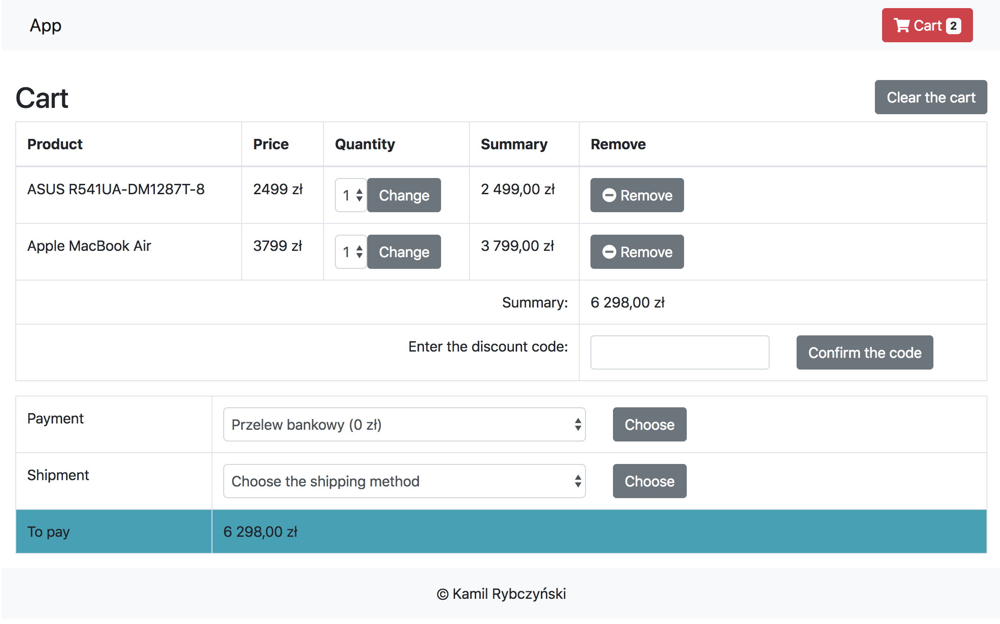

## Simple Symfony shoppingCart with some payment

### Task:

create shop script on symfony 4.1, using bootstrap, using multilang("en" is preferred) 

* add minifier from API for `prod` env

### Main shop frontend:

1) Main page: 
    * new/popular gods
    * category list
    * "searching..." line

2) Category page:
    * gods for current cat.
    * filteging
    * pagination

3) Gods view:
    * pic view in carusel mode
    * able add2cart
    * add2fav if not authorized

4) Auth:
    * in popup from header
    * in "/login" path

5) Reg:
    * also popup from upthere
    * confirmation via email(make it "spool"-ed to view links)

6) Cart:
    * gods list
    * able to change num of them
    * remove from cart
    * process to payment with fullfill with:
        * full Name
        * full addr.
        * addon info
        * if user already registred, fill it from user profile. 

7) UserProfile:
    * able to change name
    * addr
    * addon info.

#### Administrative backend:
1) Adm manage logic
2) CRUD gods
2) CRUD categories
3) User list: view,manage

#### Last achievements in adm side

1) Stat for selling: by spec period
2) Stat for user: reg by period
3) Stat for gods: by view counts
4) add fallback to managment.html if DB/PHP/others fails.

#### Must be

Code must be in good condition
*  well formatted (see full preferred in  checklist_ru.md/checklist_en.md)
*  well commented
*  no useless code
*  strict class,var,function names.
*  Thin controllers
*  Userfriendly routes 
  
 Make new features in new branch. After new feature is ready merge it into the master branch
----------------------------------------------------------------

## installation:
----------------------------------------------------------------

### Requirements

- composer
- php >= 7.4
- webpack
- mysql >= 5.6
- nodeJS >= 8.11

### Installation

- run `git clone https://github.com/v0ff4k/shop.git .` command
- run `composer install` command
- run `npm install` command to install frontend dependencies
- set `MYSQL_*` in `.env` your database connection data
- run `php bin/console doctrine:migrations:migrate` to add las database tables
- run `php bin/console doctrine:fixtures:load` to load default datas
- run `yarn add --dev @symfony/webpack-encore` to exec webpack script  
- run `yarn add webpack-notifier --dev` to 
- run `yarn encore dev` to generate the manifest.json file
- map host to `public` folder
- profit
